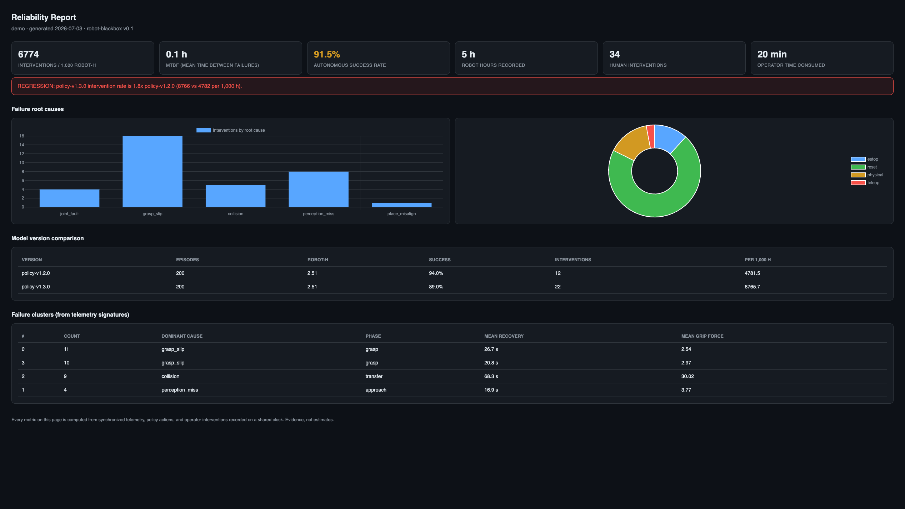

# robot-blackbox

**The flight recorder for robots.**



Robots are deploying into warehouses and factories, but nobody can answer the question every ops manager, insurer, and safety auditor is about to ask:

> *How many times did a human have to intervene, per 1,000 robot-hours — and why?*

Figure's BMW pilot logged ~390 manual interventions over its program. Intervention logs across the industry are proprietary, unstructured, and incompatible. `robot-blackbox` is a vendor-neutral recorder + analytics layer that turns robot deployments into auditable reliability evidence.

## What it does

- **Records everything on a shared clock**: joint telemetry, gripper forces, policy actions (with model version), and — critically — human interventions (pause / reset / teleop / physical assist / e-stop), each with operator, task phase, and recovery time.
- **Computes the metrics nobody has**: interventions per 1,000 robot-hours, MTBF (Mean Time Between Failures), autonomous vs. human-recovered success rates, operator time consumed.
- **Clusters failures from telemetry signatures** — root causes emerge from the data even when operators don't label them.
- **Detects regressions across model versions**: "yesterday's policy update doubled the intervention rate on grasping" — flagged automatically.
- **Generates an audit-ready HTML report** you can hand to a customer, insurer, or certifier.

## Quickstart

```bash
pip install -e .
blackbox demo            # simulates a 2-version deployment, ~400 cycles
open sessions/demo/report.html
```

The demo simulates a 6-DoF arm running pick-and-place with realistic failure modes (grasp slips, perception misses, joint faults, collisions), including a "bad model update" that the regression detector catches:

```
Interventions / 1,000 h:     …
MTBF:                        … h
Autonomous success rate:     …%

⚠ REGRESSION: policy-v1.3.0 intervention rate is 2.1x policy-v1.2.0
```

## Instrumenting a real robot

The `Recorder` API is deliberately tiny — wrap your control loop:

```python
from blackbox import Recorder
from blackbox.schema import InterventionType, Outcome

rec = Recorder("sessions/plant-a")
with rec.episode(task="bin-pick", robot_id="arm-01", model_version="v1.2") as ep:
    for state, action in control_loop():
        ep.log_frame(joint_positions=state.q, joint_velocities=state.dq,
                     gripper_force=state.force, gripper_aperture=state.aperture,
                     tcp_pose=state.tcp)
        ep.log_action(action=action.tolist(), task_phase=phase)

    # When a human steps in, the recovery is timed automatically:
    with ep.intervention(kind=InterventionType.RESET, operator_id="op-7",
                         task_phase="grasp", root_cause="grasp_slip"):
        operator_recovers_the_robot()

    ep.set_outcome(Outcome.SUCCESS)
```

Sessions are plain JSONL streams (one file per stream: `frames`, `actions`, `interventions`, `episodes`) — greppable, diffable, and easy to convert to LeRobot/RLDS-style datasets.

ROS 2 (Robot Operating System 2) adapter: planned — the schema maps 1:1 onto `joint_states` + custom intervention messages.

## Why

- Reliability — and *proving* it — is the gate between robot pilots and scale. The last 10% doesn't ship without evidence.
- ISO 25785-1 (the first safety standard for dynamically stable robots) publishes ~2027; insurers already audit deployments and void coverage on mismatches.
- Failure + recovery episodes are the scarcest, most valuable training data in embodied AI. You can't learn recovery from demonstrations that never fail.

## Status

Early prototype. Built as the wedge for a larger thesis: the operational evidence layer for physical AI. If you run robot pilots and track interventions in a spreadsheet (or not at all) — I want to talk to you.
